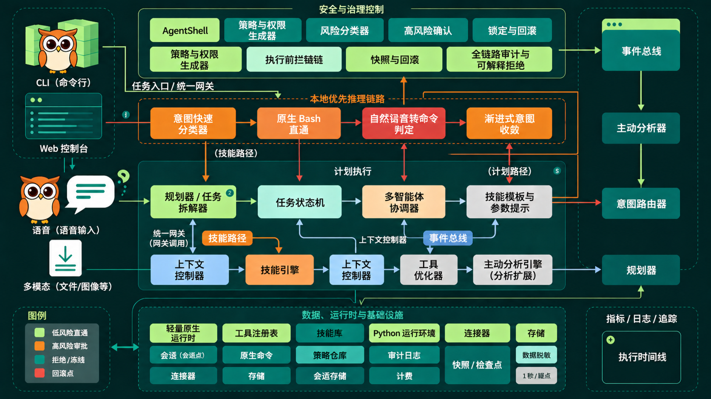

<p align="center">
  
</p>

# OS Agent设计定位

Owls 以“猫头鹰”为核心品牌意象（O / W / L / S = Observe / Workflow / Learn / Secure），四个英文词并非孤立的能力标签，而是共同构成 Owls 的产品核心亮点：

1. Observe：持续感知系统状态、执行反馈与安全风险；
2. Workflow：将用户意图组织为可执行、可审查、可落地的任务流；
3. Learn：从历史任务、失败经验和反馈数据中持续主动优化策略与执行路径；
4. Secure：通过安全策略，将整个执行过程收敛在策略约束、权限控制、审计留痕和安全恢复组成的安全闭环。

Owls 不是传统意义上的聊天助手，也不是把通用大模型直接接到 Shell 后形成的命令代理。其设计目标，是用户既可以输入自然语言，也可以输入原生 bash 命令，系统会主动做意图理解快判、安全预警和高效执行闭环。Owls 将用户用自然语言表达的业务目标，转换为受治理的计划、受约束的执行和可验证的结果，让 OS 成为具备“理解意图、组织规划、控制风险、沉淀经验、高效闭环”的原生智能助手。Owls 支持多种交互形式、音频、图像理解，并支持本地模型对接，形成数据处理自闭环，在离线弱网环境也能使用。

# OWLS

OWLS 是一款专注安全领域的生产级 OS 智能体，深耕 OS 领域，面向 Linux 系统运维、故障诊断、安全巡检、任务自动化和本地化智能分析场景。它提供命令行、TUI、Web 终端等多种入口，可以在本机环境中理解用户意图、调用工具、执行任务、沉淀经验，并通过权限控制和审计机制降低系统操作风险。

本项目当前发行形态面向 Linux 环境，保留本地命令行、终端 UI 和 Web 控制台工作流，支持接入云端模型、本地模型以及兼容 OpenAI API 的自定义模型端点。

## 核心能力

| 能力 | 说明 |
| --- | --- |
| 自然语言与原生命令双入口 | 用户可以直接描述目标，也可以输入 bash 命令；系统会进行意图理解、风险识别和执行反馈。 |
| 真实终端执行环境 | 支持本地 Shell、Docker、SSH 等 Linux 终端后端，适合系统诊断、文件处理、脚本执行和环境巡检。 |
| 受治理的任务流 | 将目标拆解为可执行步骤，并结合工具调用、审批策略、执行日志和结果校验形成闭环。 |
| 记忆与技能沉淀 | 支持会话记忆、技能安装、技能分类和任务经验复用，让重复性系统任务逐步标准化。 |
| 安全与审计 | 对高风险命令、权限操作、系统修改等行为进行安全约束，保留执行轨迹，便于审查和恢复。 |
| 多交互形态 | 支持 CLI、TUI、Web UI，并扩展音频、图像理解、本地模型和弱网离线场景。 |
| 自动化调度 | 内置定时任务能力，可用于日报、巡检、备份、审计等无人值守任务。 |
| AgentTeams 协作 | 可按用户提示词动态组织多角色协作，将复杂任务拆分给不同角色并汇总结果。 |

## 快速安装

```bash
curl -fsSL https://raw.githubusercontent.com/linfordWu/owls/main/scripts/install.sh | bash
```

安装完成后重新加载 Shell 配置：

```bash
source ~/.bashrc
# 或者
source ~/.zshrc
```

启动 OWLS：

```bash
owls
```

## 快速开始

常用命令：

```bash
owls              # 启动交互式 CLI
owls --tui        # 启动终端 TUI
owls dashboard    # 启动 Web 控制台
owls model        # 选择模型提供商和模型
owls tools        # 配置启用的工具
owls skills       # 管理技能
owls config set   # 修改单项配置
owls setup        # 运行初始化配置向导
owls update       # 更新到最新版本
owls doctor       # 检查本地环境和配置问题
```

## CLI 与 Web 使用参考

| 操作 | CLI / TUI | Web |
| --- | --- | --- |
| 开始对话 | `owls` 或 `owls --tui` | `owls dashboard` |
| 新建会话 | `/new` 或 `/reset` | 在 Web 会话列表中新建 |
| 切换模型 | `/model [provider:model]` | 通过 Web 模型控件切换 |
| 中断当前任务 | `Ctrl+C` 或发送新消息 | 点击停止/取消控件 |
| 浏览技能 | `/skills` 或 `/<skill-name>` | 技能页面 |
| 重试或撤销 | `/retry`、`/undo` | 会话操作控件 |

## 模型接入

OWLS 支持多种模型来源，包括：

- OpenRouter
- OpenAI
- Kimi / Moonshot
- z.ai / GLM
- MiniMax
- Hugging Face
- NVIDIA NIM
- 小米 MiMo
- 本地模型或兼容 OpenAI API 的私有端点

可以通过以下命令切换模型：

```bash
owls model
```

## 技能体系

OWLS 支持通过技能扩展 OS 诊断、安全巡检、故障分析、报告生成、文件处理和自动化任务能力。技能可以在 CLI 和 Web 中查看、启用和调用，并可在项目部署时默认安装。

典型技能方向包括：

- OS 诊断
- 网络诊断
- 磁盘与文件系统诊断
- CPU / GPU / NPU / 内存故障分析
- Docker 故障分析
- CoreDump / vmcore 分析
- 安全诊断
- 健康巡检与报告生成
- 根因定位与 RCA 报告

## Web 控制台

启动 Web 控制台：

```bash
owls dashboard
```

Web 控制台提供：

- 会话管理
- 模型选择
- 技能查看与分类
- 网关和服务状态查看
- 用户与权限管理
- 日志、用量、文件和终端入口

管理员用户可以创建普通用户；普通用户默认无法查看其他用户会话信息，也不展示监控、工具和系统类导航入口。

## AgentTeams

AgentTeams 是 OWLS 的多角色协作能力，不等同于传统 subagents。用户可以通过提示词指定角色分工，OWLS 会按任务需要组织不同角色协作执行，并在 tmux 模式下展示各角色的工作状态。

启动示例：

```bash
owls --teammate-mode true
owls --teammate-mode tmux
```

在提示词中可以定义角色，例如架构规划师、研发工程师、测试工程师、文档专员等，系统会依据角色职责拆解任务、执行子任务并汇总结果。

## 开发环境

开发前请先激活虚拟环境：

```bash
source venv/bin/activate
```

安装开发依赖：

```bash
uv venv venv --python 3.11
source venv/bin/activate
uv pip install -e ".[all,dev]"
```

运行测试请使用项目提供的测试脚本：

```bash
scripts/run_tests.sh
```

针对单个目录或用例运行：

```bash
scripts/run_tests.sh tests/agent/
scripts/run_tests.sh tests/agent/test_foo.py::test_x
```

## 项目结构

主要目录：

```text
owls/
├── run_agent.py          # Agent 核心对话循环
├── cli.py                # CLI 交互入口
├── model_tools.py        # 工具编排与调用
├── toolsets.py           # 工具集定义
├── agent/                # Agent 内部能力
├── tools/                # 工具实现
├── gateway/              # 消息网关
├── ui-tui/               # 终端 TUI
├── tui_gateway/          # TUI 后端
├── owls_cli/             # CLI 子命令、配置、Web UI
├── skills/               # 内置技能
└── tests/                # 测试用例
```

## 许可证

本项目采用 MIT License，详见 [LICENSE](LICENSE)。
